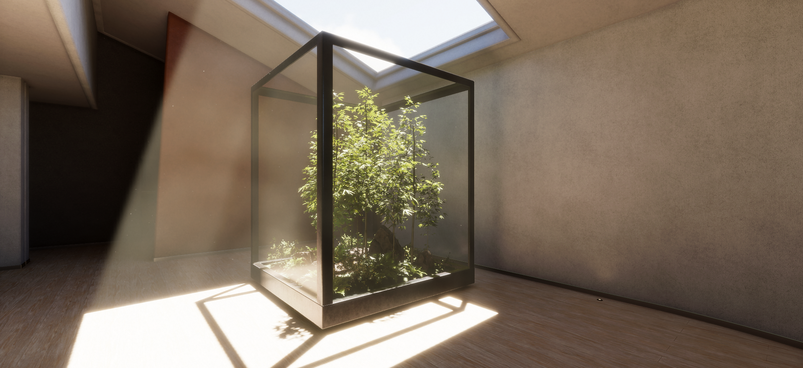
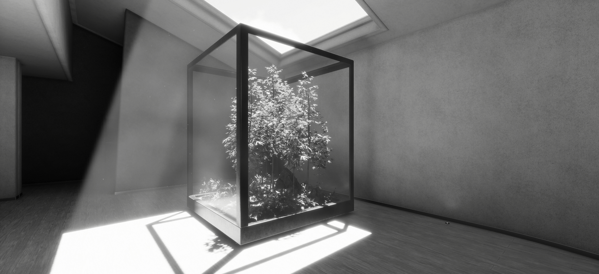

# Unity Grayscale post-processing | HDRP
Simple post-processing for grayscale rendering. Compatible with HDRP. The post-processing includes several methods for converting an RGB stream to grayscale (Rec 601, Rec 709, Average and Lightness).

## How to use:
Go to Project Settings > Graphics > HDRP Global Settings > Custom Post Process Order.
Add it under After Post Process.
Add the post-processing to a post-process volume.

